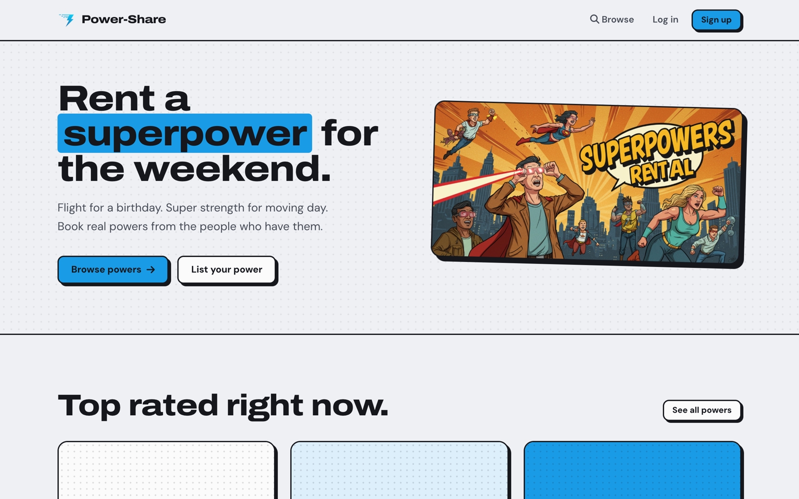
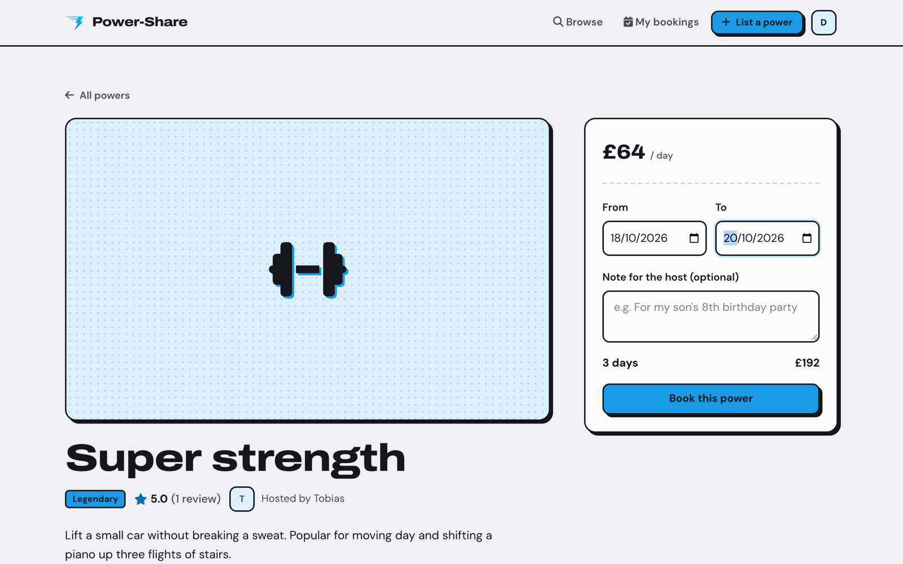
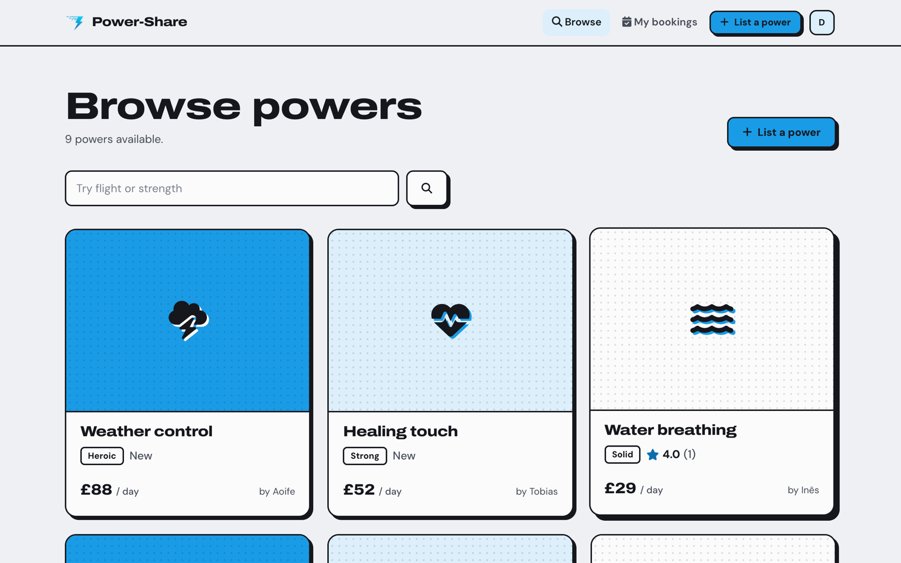
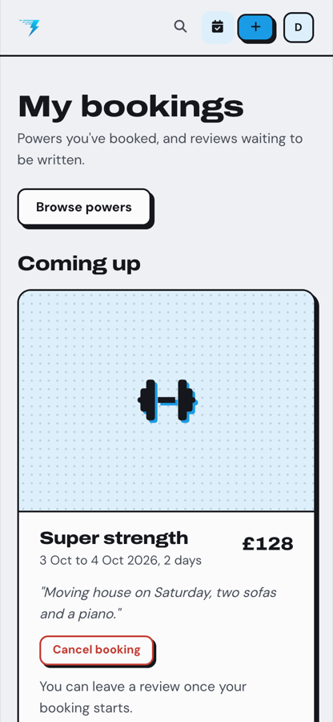

# Power-Share

A marketplace for renting superpowers. Hosts list a power with a daily price, and anyone can book it for a few days and leave a review afterwards.

**Live demo:** https://power-share-sgq3.onrender.com
Log in with `demo@power-share.app` / `password123`. The demo resets every night. It runs on a free server, so the first visit can take up to a minute to wake up.



## What it does

- Browse and search listed powers, with ratings and price per day
- Book a power for a date range and see the total before confirming
- Stops double bookings, past dates and booking your own power
- List your own power, then edit or delete it
- Review a power once your booking has started, one review per person
- Cancel upcoming bookings from your bookings page



| Browse | On mobile |
|---|---|
|  |  |

## Built with

Ruby on Rails 8, PostgreSQL, Hotwire (Turbo and Stimulus), Devise, Bootstrap and SCSS, Cloudinary for listing photos.

## Run it locally

You need Ruby 3.3.5 and PostgreSQL running.

```bash
git clone https://github.com/itsdakpan/power-share.git
cd power-share
bundle install
bin/rails db:setup
bin/rails server
```

Open http://localhost:3000 and log in with the demo account:

- Email: `demo@power-share.app`
- Password: `password123`

Listing photos upload to Cloudinary, so add a `CLOUDINARY_URL` to a `.env` file. Without one, set `config.active_storage.service = :local` in `config/environments/development.rb`.

## Background

Built in one week by a team of six on the Le Wagon web development bootcamp in May 2025.

I later came back to it on my own to redesign the interface, upgrade it to Rails 8 and fix the bugs we ran out of time for. The main ones: most pages crashed if you weren't logged in, anyone could delete anyone's booking, reviews could be left without ever booking, and the edit listing route didn't exist.
